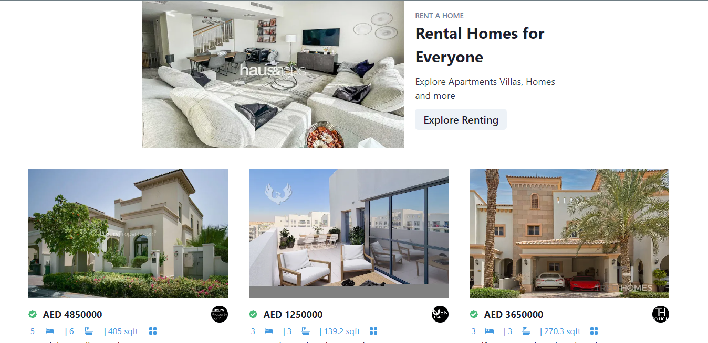
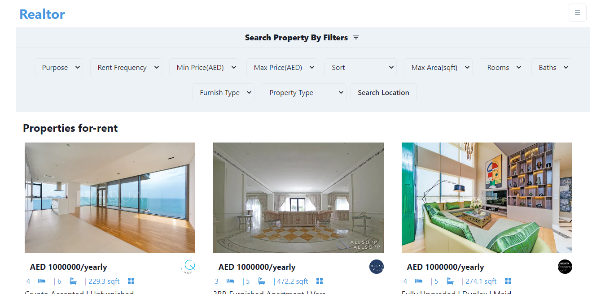

# Real-Estate-Web-App
This is a [Next.js](https://nextjs.org/) project bootstrapped with [`create-next-app`](https://github.com/vercel/next.js/tree/canary/packages/create-next-app).

## Table of contents

- [Overview](#overview)
  - [The challenge](#the-challenge)
  - [Screenshot](#screenshot)
  - [Links](#links)
- [My process](#my-process)
  - [Built with](#built-with)
  - [What I learned](#what-i-learned)
  - [Useful resources](#useful-resources)

## Overview

### The challenge

Users should be able to:

- View the optimal layout for the site depending on their device's screen size
- Search
- view results
- Navigate to another page

### Screenshot




### Links

- Solution URL: (https://github.com/faozziyyah/real-estate)
- Live Site URL: (https://real-estate-app-faozziyyah.vercel.app/)

## My process

### Built with

- CSS
- [NextJs](https://nextjs.org/) - ReactJS Framework
- [Chakra UI](https://chakra-ui.com/) - Chakra UI
- [Rapid API](https://rapidapi.com/hub?utm_source=youtube.com%2FJavaScriptMastery&utm_medium=DevRel&utm_campaign=DevRel) - Rapid API

### What I learned

- How to use Chakra UI and Rapid APIin NextJs

```Next.js
const Banner = ({ purpose, title1, title2, desc1, desc2, buttonText, linkName, imageUrl }) => (
  <Flex flexWrap="wrap" justifyContent="center" alignItems="center" m="10">
    <Image src={imageUrl} width={500} height={300} alt="banner" />
    <Box p="5">
      <Text color="gray.500" fontSize="sm" fontWeight="medium">{purpose}</Text>
      <Text fontSize="3xl" fontWeight="bold">{title1} <br /> {title2} </Text>
      <Text fontSize="lg" paddingTop="3" paddingBottom="3" color="gray.700">{desc1} <br /> {desc2}</Text>
      <Button fontSize="xl">
        <Link href={linkName}>{buttonText}</Link>
      </Button>
    </Box>
  </Flex>
)
```

### Useful resources
## Getting Started

First, run the development server:

```bash
npm run dev
# or
yarn dev
```

Open [http://localhost:3000](http://localhost:3000) with your browser to see the result.

You can start editing the page by modifying `pages/index.js`. The page auto-updates as you edit the file.

[API routes](https://nextjs.org/docs/api-routes/introduction) can be accessed on [http://localhost:3000/api/hello](http://localhost:3000/api/hello). This endpoint can be edited in `pages/api/hello.js`.

The `pages/api` directory is mapped to `/api/*`. Files in this directory are treated as [API routes](https://nextjs.org/docs/api-routes/introduction) instead of React pages.

## Learn More

To learn more about Next.js, take a look at the following resources:

- [Next.js Documentation](https://nextjs.org/docs) - learn about Next.js features and API.
- [Learn Next.js](https://nextjs.org/learn) - an interactive Next.js tutorial.

You can check out [the Next.js GitHub repository](https://github.com/vercel/next.js/) - your feedback and contributions are welcome!

## Deploy on Vercel

The easiest way to deploy your Next.js app is to use the [Vercel Platform](https://vercel.com/new?utm_medium=default-template&filter=next.js&utm_source=create-next-app&utm_campaign=create-next-app-readme) from the creators of Next.js.

Check out our [Next.js deployment documentation](https://nextjs.org/docs/deployment) for more details.
